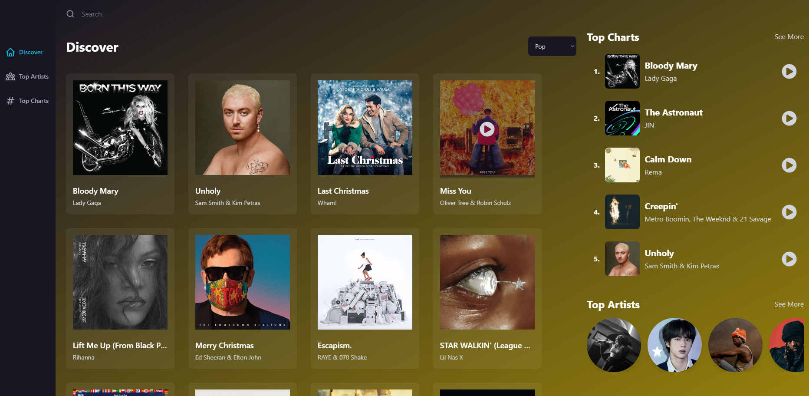
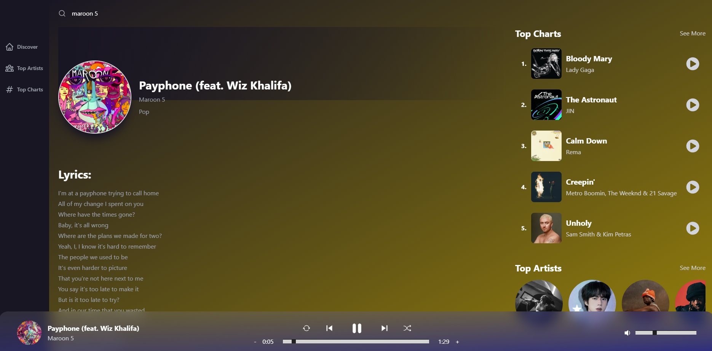
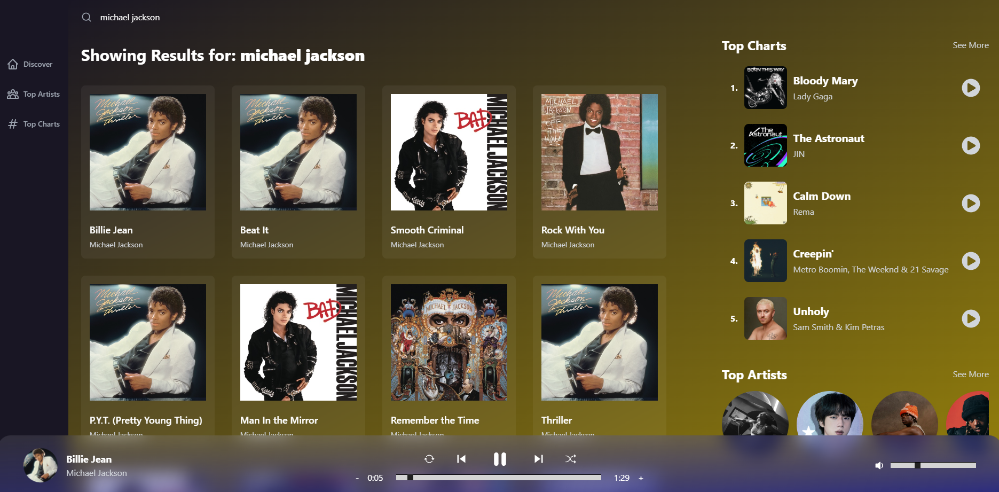

# MusicWebApp

Music Player Created with React, RapidAPI, Redux, and Tailwind CSS

# Features:
* API extraction and usage (Music information, artist information)
* React toolkit used to create Music Player, Widgets, and website layout
* React and tailwind tools used to make website accesible on all devices
* Supports search function

# [Try the app here](https://elyghthao.github.io/MusicWebApp/)

